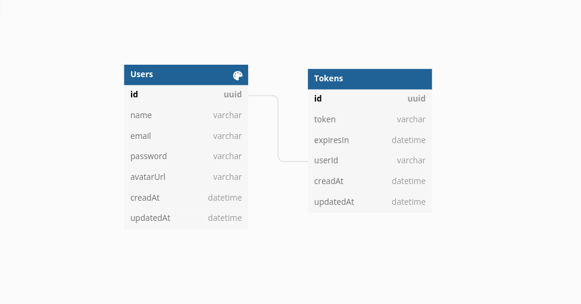

# Autenticação Basica com JWT

Uma implementação de autenticação basica com JWT. Utilizando os princípios  SOLID,
DDD, TDD.

---

## Deploy
[depoy](https://auth-express-tdd-solid.herokuapp.com/)

## Docks
[docks](https://auth-express-tdd-solid.herokuapp.com/)
## Database Schema

## Tecnologias utilizadas

- Express
- Jest
- PostgreSQL
- Docker
- Swagger
- Pino
- JWT
- Bcrypt
- Prisma
- Typescript
- Babel
- Class Validator
- Class Transform